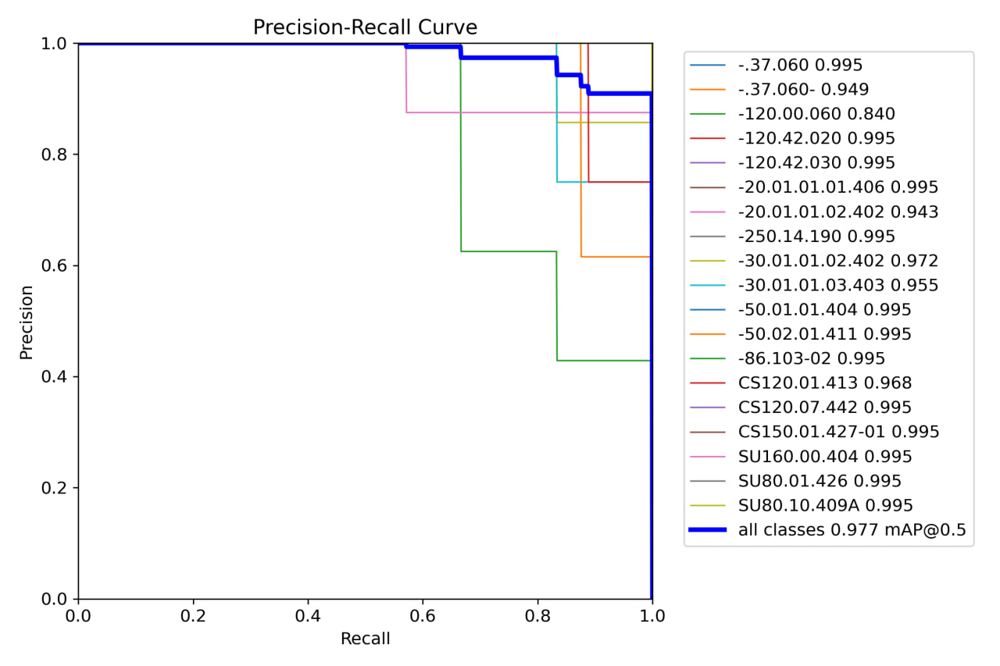

Модель Nano самая маленькая из обученных нами, выдаёт mAp@0.5 на уровне 95.8%, быстродействующая, может работать в режиме реального времени даже на маломощных устройствах, например мобильном телефоне.

Модель Large самая точная, но в то же время самая энергозатратная, выдаёт mAP@0.5 на уровне 99%, для её быстрой работы требуется высокопроизводительная машина, например ПК с видеокартой RTX1080, в таком случае детекция в режиме реального времени будет происходить со скоростью 13 fps.
Также данную модель можно использовать на маломощных устройствах, но в режиме детекции по фото, в таком случае обработка фото будет занимать до 10 сек.

Модель Small является оптимальным вариантом, если выбирать между быстродействием и точностью работы, выдаёт mAP@0.5 на уровне 97,7%.

